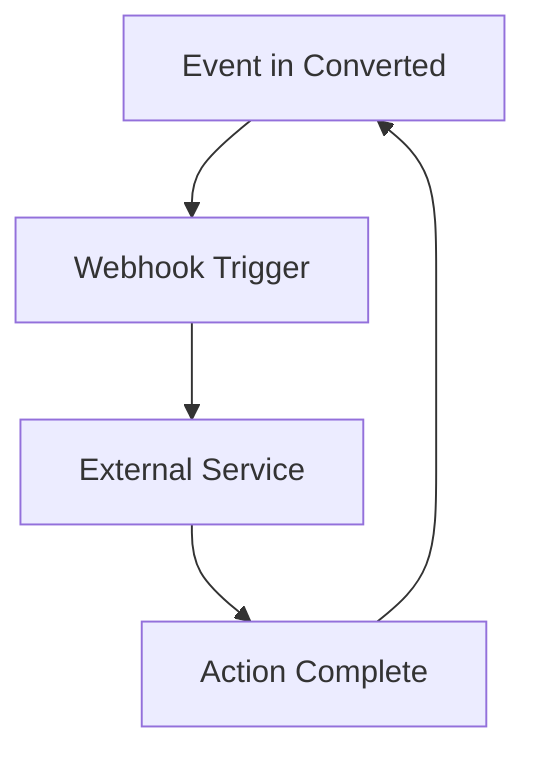

## Overview

Connect Converted to your favorite tools to automate workflows, sync content, and enhance collaboration. Popular integrations include GitHub for repository syncing, Slack for notifications, and custom webhooks for real-time updates. Use the Converted API for advanced connections and embed docs in external sites using iframes.

<Callout kind="info">
Review available integrations and follow the setup steps below to get started quickly.
</Callout>

## Popular Integrations

Discover ready-to-use connections that supercharge your documentation process.

<Columns cols={3}>
  <Card title="GitHub" icon="github" href="https://github.com/apps/converted-docs/installations/new">
    Sync documentation directly from your GitHub repositories. Push changes and auto-publish updates.
  </Card>
  <Card title="Slack" icon="message-circle" href="/configuration/slack">
    Receive notifications for page views, edits, and new comments in your Slack channels.
  </Card>
  <Card title="Zapier" icon="zap" href="https://zapier.com/developer/public-api/integrations/converted">
    Build no-code automations with thousands of apps using Zapier.
  </Card>
</Columns>

## Setting Up API Access

Generate an API key to access Converted programmatically. This enables custom scripts, CI/CD pipelines, and third-party apps.

<Steps>
  <Step title="Create API Key" icon="key">
    Navigate to your account settings and select "API Keys". Click "Generate New Key".
  </Step>
  <Step title="Copy the Key" icon="copy">
    Store the key securely. It displays only once.
  </Step>
  <Step title="Use in Requests" icon="code">
    Include the key in the `Authorization` header.
  </Step>
</Steps>

<ParamField header="Authorization" param-type="string" required="true">
  `Bearer YOUR_API_KEY`
</ParamField>

<ParamField header="Content-Type" param-type="string" required="true">
  `application/json`
</ParamField>

Example request to list documents:

<CodeGroup tabs="JavaScript,cURL">
  ```javascript
  const response = await fetch('https://api.example.com/v1/documents', {
    headers: {
      'Authorization': 'Bearer YOUR_API_KEY',
      'Content-Type': 'application/json'
    }
  });
  const docs = await response.json();
  console.log(docs);
  ```
  ```bash
  curl -H "Authorization: Bearer YOUR_API_KEY" \
       -H "Content-Type: application/json" \
       https://api.example.com/v1/documents
  ```
</CodeGroup>

## Webhooks for Automated Updates

Set up webhooks to trigger actions on events like page publishes or user logins. Configure the endpoint URL in your project settings.

<Tabs>
  <Tab title="GitHub Webhook" icon="github">
    ```javascript
    // Payload example
    {
      "event": "page.published",
      "document_id": "doc_123",
      "url": "https://docs.example.com/doc-123"
    }
    ```
  </Tab>
  <Tab title="Slack Incoming Webhook" icon="message-circle">
    Configure Slack's incoming webhook URL: `https://hooks.slack.com/services/YOUR/SLACK/WEBHOOK`
    
    ```javascript
    // Send notification
    await fetch('https://hooks.slack.com/services/YOUR/SLACK/WEBHOOK', {
      method: 'POST',
      body: JSON.stringify({
        text: 'New doc published: https://docs.example.com/doc-123'
      })
    });
    ```
  </Tab>
</Tabs>

## Embedding Docs in External Sites

Embed individual pages or search results using iframes for seamless integration.

```html
<iframe
  src="https://docs.example.com/embed/doc-123"
  width="100%"
  height="600"
  frameborder="0">
</iframe>
```

Customize with query parameters:

- `theme=dark` for dark mode
- `search=query` for pre-filled search

## Best Practices

<Callout kind="tip">
Always use HTTPS for webhook endpoints and rotate API keys regularly.
</Callout>

<Expandable title="Advanced Security" default-open="false">
  - Implement IP whitelisting for webhooks
  - Use HMAC signatures to verify payloads
  - Monitor API usage in your dashboard at `https://dashboard.example.com/usage`
</Expandable>



Follow these practices to maintain secure, reliable integrations. For more details, check [GitHub Integration](/configuration/github) or contact support.