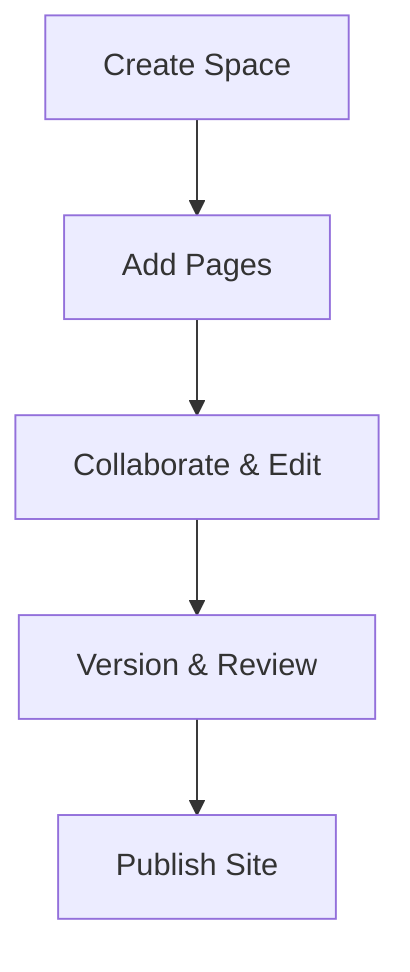

<Callout kind="info" title="Starter Kit Template">
  This documentation was generated as a starter kit template based on your brand. Please review and customize the content to accurately reflect your product's features, APIs, and capabilities.
</Callout>

## Overview

Converted provides a centralized space to organize, manage, and collaborate on all your project documentation. You create structured docs spaces for teams, track changes with version history, and publish polished documentation sites effortlessly. Benefit from intuitive tools that streamline workflows, ensuring your documentation stays up-to-date and accessible.

Key advantages include real-time collaboration, customizable themes matching your brand (like `#42C1F0`), and seamless integration with your existing tools.

## Key Features

<Columns cols={3}>
  <Card title="Organized Spaces" icon="layout" href="#quick-start">
    Create dedicated documentation spaces for projects, teams, or clients. Structure content with pages, folders, and nested hierarchies.
  </Card>
  <Card title="Version Control" icon="git-branch" href="/quickstart">
    Track changes, revert edits, and maintain history without complexity. Collaborate without overwriting work.
  </Card>
  <Card title="Custom Publishing" icon="globe" href="/configuration">
    Publish beautiful, responsive docs sites with your branding. Embed components and interactive elements.
  </Card>
</Columns>

## Quick Start

Get running in minutes with these steps.

<Steps>
  <Step title="Create Account" icon="user-plus">
    Sign up at `https://app.converted.co.uk` using your email.
  </Step>
  <Step title="New Space" icon="plus">
    Click **New Space** and name it for your project, like "Marketing Docs".
  </Step>
  <Step title="Add Content" icon="file-text">
    Create your first page and start editing with Markdown or the visual editor.
  </Step>
  <Step title="Publish" icon="rocket">
    Preview and publish your site. Share the live URL with your team.
  </Step>
</Steps>

<CodeGroup tabs="Markdown,Visual">
  ```markdown
  # Welcome to My Docs

  Start writing here.

  - List items
  - With links: [Converted](https://converted.co.uk)
  ```
  ```html
  <h1>Welcome to My Docs</h1>

  <p>Start writing here.</p>

  <ul>
    <li>List items</li>
    <li>With links: <a href="https://converted.co.uk">Converted</a></li>
  </ul>
  ```
</CodeGroup>

## Who Should Use Converted

<Tabs>
  <Tab title="Teams & Agencies" icon="users">
    Marketing agencies like those offering PPC, SEO, and CRO services use Converted to manage client docs, case studies, and resources centrally.
  </Tab>
  <Tab title="Developers & PMs" icon="code">
    Product managers and devs document APIs, workflows, and specs with versioned pages and embeds.
  </Tab>
  <Tab title="eCommerce & Charities" icon="shopping-bag">
    eCommerce teams track campaigns, while charities organize fundraising docs and reports.
  </Tab>
</Tabs>

## Basic Workflow



This simple flow keeps your documentation alive: create, edit, review, publish.

## Next Steps

<Columns cols={2}>
  <Card title="Quickstart Guide" icon="zap" href="/quickstart">
    Dive into full setup with detailed instructions.
  </Card>
  <Card title="Authentication" icon="lock" href="/authentication">
    Secure your spaces and manage access.
  </Card>
</Columns>

<Callout kind="tip">
  Ready to convert your docs? Head to the [Quickstart](/quickstart) for hands-on setup.
</Callout>